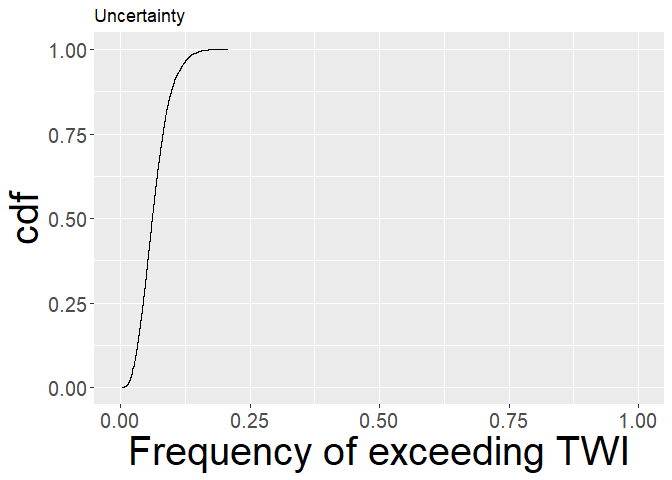

<!-- README.md is generated from README.Rmd. Please edit that file -->

# ppvsbp

<!-- badges: start -->

<!-- badges: end -->

The aim of `ppvsbp` package is to make available the code used in the
paper " A comparison between precise and bounded probability to quantify
epistemic uncertainty in a scientific assessment" …

## Installation

You can install the development version of `ppvsbp` from
[github](https://github.com/Iraices/PrecisePvsBoundedP) with:

``` r
remotes::install_github('Iraices/PrecisePvsBoundedP')
#> Skipping install of 'ppvsbp' from a github remote, the SHA1 (fb440438) has not changed since last install.
#>   Use `force = TRUE` to force installation
```

## Example

This example does the aluminium exposure assessment by precise
probability.

First, let us estimate the probability of exceeding the safety threshold
for all chidren

``` r
library(ppvsbp)
## basic example code
TWI_pp <- unc_analysis_assessment(niter_ale = 5000, niter_epi = 5000, threshold = 1,
                                  percentile_ale = NULL,
                                  suff_stat_concentration = data_assessment$log_concentration_ss_data,
                                  suff_stat_consumption = data_assessment$log_consumption_ss_data,
                                  consumption_change_vals_EKE = data_assessment$change_cons$vals,
                                  consumption_change_probs_EKE = data_assessment$change_cons$probs/100,
                                  consumers_info_sample_size = data_assessment$consumers_info_sample_size,
                                  concentration_mu0 = 3.5, concentration_v0 = 5, concentration_alpha0 = 1,
                                  concentration_beta0 = 1, sufficient_statistics_concentration = TRUE,
                                  consumption_mu0 = -3, consumption_v0 = 5, consumption_alpha0 = 1,
                                  consumption_beta0 = 1, sufficient_statistics_consumption = TRUE,
                                  consumption_event_alpha0 = 1, consumption_event_beta0 = 1)
## Outputs
str(TWI_pp)
#> List of 6
#>  $ prob_consumption_event  :List of 7
#>   ..$ : num 0.127
#>   ..$ : num 0.639
#>   ..$ : num 0.222
#>   ..$ : num 0.121
#>   ..$ : num 0.27
#>   ..$ : num 0.468
#>   ..$ : num 0.326
#>  $ parameters_concentration:List of 7
#>   ..$ :List of 2
#>   .. ..$ prior    :List of 4
#>   .. .. ..$ mu   : num 3.5
#>   .. .. ..$ v    : num 5
#>   .. .. ..$ alpha: num 1
#>   .. .. ..$ beta : num 1
#>   .. ..$ posterior:List of 4
#>   .. .. ..$ mu   : num 3.02
#>   .. .. ..$ v    : num 158
#>   .. .. ..$ alpha: num 77.5
#>   .. .. ..$ beta : num 25.3
#>   ..$ :List of 2
#>   .. ..$ prior    :List of 4
#>   .. .. ..$ mu   : num 3.5
#>   .. .. ..$ v    : num 5
#>   .. .. ..$ alpha: num 1
#>   .. .. ..$ beta : num 1
#>   .. ..$ posterior:List of 4
#>   .. .. ..$ mu   : num 2.78
#>   .. .. ..$ v    : num 376
#>   .. .. ..$ alpha: num 186
#>   .. .. ..$ beta : num 256
#>   ..$ :List of 2
#>   .. ..$ prior    :List of 4
#>   .. .. ..$ mu   : num 3.5
#>   .. .. ..$ v    : num 5
#>   .. .. ..$ alpha: num 1
#>   .. .. ..$ beta : num 1
#>   .. ..$ posterior:List of 4
#>   .. .. ..$ mu   : num 3.3
#>   .. .. ..$ v    : num 26
#>   .. .. ..$ alpha: num 11.5
#>   .. .. ..$ beta : num 7
#>   ..$ :List of 2
#>   .. ..$ prior    :List of 4
#>   .. .. ..$ mu   : num 3.5
#>   .. .. ..$ v    : num 5
#>   .. .. ..$ alpha: num 1
#>   .. .. ..$ beta : num 1
#>   .. ..$ posterior:List of 4
#>   .. .. ..$ mu   : num 2.73
#>   .. .. ..$ v    : num 66
#>   .. .. ..$ alpha: num 31.5
#>   .. .. ..$ beta : num 34.1
#>   ..$ :List of 2
#>   .. ..$ prior    :List of 4
#>   .. .. ..$ mu   : num 3.5
#>   .. .. ..$ v    : num 5
#>   .. .. ..$ alpha: num 1
#>   .. .. ..$ beta : num 1
#>   .. ..$ posterior:List of 4
#>   .. .. ..$ mu   : num 3.75
#>   .. .. ..$ v    : num 505
#>   .. .. ..$ alpha: num 251
#>   .. .. ..$ beta : num 78.8
#>   ..$ :List of 2
#>   .. ..$ prior    :List of 4
#>   .. .. ..$ mu   : num 3.5
#>   .. .. ..$ v    : num 5
#>   .. .. ..$ alpha: num 1
#>   .. .. ..$ beta : num 1
#>   .. ..$ posterior:List of 4
#>   .. .. ..$ mu   : num 4.94
#>   .. .. ..$ v    : num 494
#>   .. .. ..$ alpha: num 246
#>   .. .. ..$ beta : num 48.6
#>   ..$ :List of 2
#>   .. ..$ prior    :List of 4
#>   .. .. ..$ mu   : num 3.5
#>   .. .. ..$ v    : num 5
#>   .. .. ..$ alpha: num 1
#>   .. .. ..$ beta : num 1
#>   .. ..$ posterior:List of 4
#>   .. .. ..$ mu   : num 3.38
#>   .. .. ..$ v    : num 56
#>   .. .. ..$ alpha: num 26.5
#>   .. .. ..$ beta : num 9.88
#>  $ parameters_consumption  :List of 7
#>   ..$ :List of 2
#>   .. ..$ prior    :List of 4
#>   .. .. ..$ mu   : num -3
#>   .. .. ..$ v    : num 5
#>   .. .. ..$ alpha: num 1
#>   .. .. ..$ beta : num 1
#>   .. ..$ posterior:List of 4
#>   .. .. ..$ mu   : num -2.21
#>   .. .. ..$ v    : num 112
#>   .. .. ..$ alpha: num 54.5
#>   .. .. ..$ beta : num 47.1
#>   ..$ :List of 2
#>   .. ..$ prior    :List of 4
#>   .. .. ..$ mu   : num -3
#>   .. .. ..$ v    : num 5
#>   .. .. ..$ alpha: num 1
#>   .. .. ..$ beta : num 1
#>   .. ..$ posterior:List of 4
#>   .. .. ..$ mu   : num -1.67
#>   .. .. ..$ v    : num 486
#>   .. .. ..$ alpha: num 242
#>   .. .. ..$ beta : num 266
#>   ..$ :List of 2
#>   .. ..$ prior    :List of 4
#>   .. .. ..$ mu   : num -3
#>   .. .. ..$ v    : num 5
#>   .. .. ..$ alpha: num 1
#>   .. .. ..$ beta : num 1
#>   .. ..$ posterior:List of 4
#>   .. .. ..$ mu   : num -2.3
#>   .. .. ..$ v    : num 176
#>   .. .. ..$ alpha: num 86.5
#>   .. .. ..$ beta : num 82.9
#>   ..$ :List of 2
#>   .. ..$ prior    :List of 4
#>   .. .. ..$ mu   : num -3
#>   .. .. ..$ v    : num 5
#>   .. .. ..$ alpha: num 1
#>   .. .. ..$ beta : num 1
#>   .. ..$ posterior:List of 4
#>   .. .. ..$ mu   : num -2.09
#>   .. .. ..$ v    : num 100
#>   .. .. ..$ alpha: num 48.5
#>   .. .. ..$ beta : num 78.5
#>   ..$ :List of 2
#>   .. ..$ prior    :List of 4
#>   .. .. ..$ mu   : num -3
#>   .. .. ..$ v    : num 5
#>   .. .. ..$ alpha: num 1
#>   .. .. ..$ beta : num 1
#>   .. ..$ posterior:List of 4
#>   .. .. ..$ mu   : num -2.67
#>   .. .. ..$ v    : num 199
#>   .. .. ..$ alpha: num 98
#>   .. .. ..$ beta : num 109
#>   ..$ :List of 2
#>   .. ..$ prior    :List of 4
#>   .. .. ..$ mu   : num -3
#>   .. .. ..$ v    : num 5
#>   .. .. ..$ alpha: num 1
#>   .. .. ..$ beta : num 1
#>   .. ..$ posterior:List of 4
#>   .. .. ..$ mu   : num -3.99
#>   .. .. ..$ v    : num 353
#>   .. .. ..$ alpha: num 175
#>   .. .. ..$ beta : num 296
#>   ..$ :List of 2
#>   .. ..$ prior    :List of 4
#>   .. .. ..$ mu   : num -3
#>   .. .. ..$ v    : num 5
#>   .. .. ..$ alpha: num 1
#>   .. .. ..$ beta : num 1
#>   .. ..$ posterior:List of 4
#>   .. .. ..$ mu   : num -2.01
#>   .. .. ..$ v    : num 226
#>   .. .. ..$ alpha: num 112
#>   .. .. ..$ beta : num 184
#>  $ prob_exceed             : num [1:5000] 0.043 0.0402 0.052 0.0414 0.0422 0.0318 0.0512 0.047 0.0524 0.0506 ...
#>  $ expected_prob_exceed    : num 0.04
#>  $ hdi_prob_exceed         : Named num [1:2] 0.0094 0.0706
#>   ..- attr(*, "names")= chr [1:2] "lower" "upper"
#>   ..- attr(*, "credMass")= num 0.95

## Expected probability of exceeding the safety threshold
TWI_pp$expected_prob_exceed
#> [1] 0.03999584

## Highest posterior density interval of the probability of exceeding the safety threshold
TWI_pp$hdi_prob_exceed
#>  lower  upper 
#> 0.0094 0.0706 
#> attr(,"credMass")
#> [1] 0.95
```

Second, let us estimate the probability of exceeding the safety
threshold for a high consumer child. Note, the argument `percentile_ale`
has changed `percentile_ale = 95`.

``` r
  TWI_pp_high_consumer <- unc_analysis_assessment(niter_ale = 5000, niter_epi = 5000, threshold = 1,
                                   percentile_ale = 95,
                                   suff_stat_concentration = data_assessment$log_concentration_ss_data,
                                   suff_stat_consumption = data_assessment$log_consumption_ss_data,
                                   consumption_change_vals_EKE = data_assessment$change_cons$vals,
                                   consumption_change_probs_EKE = data_assessment$change_cons$probs/100,
                                   consumers_info_sample_size = data_assessment$consumers_info_sample_size,
                                   concentration_mu0 = 3.5, concentration_v0 = 5, concentration_alpha0 = 1,
                                   concentration_beta0 = 1, sufficient_statistics_concentration = TRUE,
                                   consumption_mu0 = -3, consumption_v0 = 5, consumption_alpha0 = 1,
                                   consumption_beta0 = 1, sufficient_statistics_consumption = TRUE,
                                   consumption_event_alpha0 = 1, consumption_event_beta0 = 1)

## Outputs
str(TWI_pp_high_consumer)
#> List of 6
#>  $ prob_consumption_event  :List of 7
#>   ..$ : num 0.144
#>   ..$ : num 0.646
#>   ..$ : num 0.216
#>   ..$ : num 0.125
#>   ..$ : num 0.255
#>   ..$ : num 0.468
#>   ..$ : num 0.289
#>  $ parameters_concentration:List of 7
#>   ..$ :List of 2
#>   .. ..$ prior    :List of 4
#>   .. .. ..$ mu   : num 3.5
#>   .. .. ..$ v    : num 5
#>   .. .. ..$ alpha: num 1
#>   .. .. ..$ beta : num 1
#>   .. ..$ posterior:List of 4
#>   .. .. ..$ mu   : num 3.02
#>   .. .. ..$ v    : num 158
#>   .. .. ..$ alpha: num 77.5
#>   .. .. ..$ beta : num 25.3
#>   ..$ :List of 2
#>   .. ..$ prior    :List of 4
#>   .. .. ..$ mu   : num 3.5
#>   .. .. ..$ v    : num 5
#>   .. .. ..$ alpha: num 1
#>   .. .. ..$ beta : num 1
#>   .. ..$ posterior:List of 4
#>   .. .. ..$ mu   : num 2.78
#>   .. .. ..$ v    : num 376
#>   .. .. ..$ alpha: num 186
#>   .. .. ..$ beta : num 256
#>   ..$ :List of 2
#>   .. ..$ prior    :List of 4
#>   .. .. ..$ mu   : num 3.5
#>   .. .. ..$ v    : num 5
#>   .. .. ..$ alpha: num 1
#>   .. .. ..$ beta : num 1
#>   .. ..$ posterior:List of 4
#>   .. .. ..$ mu   : num 3.3
#>   .. .. ..$ v    : num 26
#>   .. .. ..$ alpha: num 11.5
#>   .. .. ..$ beta : num 7
#>   ..$ :List of 2
#>   .. ..$ prior    :List of 4
#>   .. .. ..$ mu   : num 3.5
#>   .. .. ..$ v    : num 5
#>   .. .. ..$ alpha: num 1
#>   .. .. ..$ beta : num 1
#>   .. ..$ posterior:List of 4
#>   .. .. ..$ mu   : num 2.73
#>   .. .. ..$ v    : num 66
#>   .. .. ..$ alpha: num 31.5
#>   .. .. ..$ beta : num 34.1
#>   ..$ :List of 2
#>   .. ..$ prior    :List of 4
#>   .. .. ..$ mu   : num 3.5
#>   .. .. ..$ v    : num 5
#>   .. .. ..$ alpha: num 1
#>   .. .. ..$ beta : num 1
#>   .. ..$ posterior:List of 4
#>   .. .. ..$ mu   : num 3.75
#>   .. .. ..$ v    : num 505
#>   .. .. ..$ alpha: num 251
#>   .. .. ..$ beta : num 78.8
#>   ..$ :List of 2
#>   .. ..$ prior    :List of 4
#>   .. .. ..$ mu   : num 3.5
#>   .. .. ..$ v    : num 5
#>   .. .. ..$ alpha: num 1
#>   .. .. ..$ beta : num 1
#>   .. ..$ posterior:List of 4
#>   .. .. ..$ mu   : num 4.94
#>   .. .. ..$ v    : num 494
#>   .. .. ..$ alpha: num 246
#>   .. .. ..$ beta : num 48.6
#>   ..$ :List of 2
#>   .. ..$ prior    :List of 4
#>   .. .. ..$ mu   : num 3.5
#>   .. .. ..$ v    : num 5
#>   .. .. ..$ alpha: num 1
#>   .. .. ..$ beta : num 1
#>   .. ..$ posterior:List of 4
#>   .. .. ..$ mu   : num 3.38
#>   .. .. ..$ v    : num 56
#>   .. .. ..$ alpha: num 26.5
#>   .. .. ..$ beta : num 9.88
#>  $ parameters_consumption  :List of 7
#>   ..$ :List of 2
#>   .. ..$ prior    :List of 4
#>   .. .. ..$ mu   : num -3
#>   .. .. ..$ v    : num 5
#>   .. .. ..$ alpha: num 1
#>   .. .. ..$ beta : num 1
#>   .. ..$ posterior:List of 4
#>   .. .. ..$ mu   : num -2.21
#>   .. .. ..$ v    : num 112
#>   .. .. ..$ alpha: num 54.5
#>   .. .. ..$ beta : num 47.1
#>   ..$ :List of 2
#>   .. ..$ prior    :List of 4
#>   .. .. ..$ mu   : num -3
#>   .. .. ..$ v    : num 5
#>   .. .. ..$ alpha: num 1
#>   .. .. ..$ beta : num 1
#>   .. ..$ posterior:List of 4
#>   .. .. ..$ mu   : num -1.67
#>   .. .. ..$ v    : num 486
#>   .. .. ..$ alpha: num 242
#>   .. .. ..$ beta : num 266
#>   ..$ :List of 2
#>   .. ..$ prior    :List of 4
#>   .. .. ..$ mu   : num -3
#>   .. .. ..$ v    : num 5
#>   .. .. ..$ alpha: num 1
#>   .. .. ..$ beta : num 1
#>   .. ..$ posterior:List of 4
#>   .. .. ..$ mu   : num -2.3
#>   .. .. ..$ v    : num 176
#>   .. .. ..$ alpha: num 86.5
#>   .. .. ..$ beta : num 82.9
#>   ..$ :List of 2
#>   .. ..$ prior    :List of 4
#>   .. .. ..$ mu   : num -3
#>   .. .. ..$ v    : num 5
#>   .. .. ..$ alpha: num 1
#>   .. .. ..$ beta : num 1
#>   .. ..$ posterior:List of 4
#>   .. .. ..$ mu   : num -2.09
#>   .. .. ..$ v    : num 100
#>   .. .. ..$ alpha: num 48.5
#>   .. .. ..$ beta : num 78.5
#>   ..$ :List of 2
#>   .. ..$ prior    :List of 4
#>   .. .. ..$ mu   : num -3
#>   .. .. ..$ v    : num 5
#>   .. .. ..$ alpha: num 1
#>   .. .. ..$ beta : num 1
#>   .. ..$ posterior:List of 4
#>   .. .. ..$ mu   : num -2.67
#>   .. .. ..$ v    : num 199
#>   .. .. ..$ alpha: num 98
#>   .. .. ..$ beta : num 109
#>   ..$ :List of 2
#>   .. ..$ prior    :List of 4
#>   .. .. ..$ mu   : num -3
#>   .. .. ..$ v    : num 5
#>   .. .. ..$ alpha: num 1
#>   .. .. ..$ beta : num 1
#>   .. ..$ posterior:List of 4
#>   .. .. ..$ mu   : num -3.99
#>   .. .. ..$ v    : num 353
#>   .. .. ..$ alpha: num 175
#>   .. .. ..$ beta : num 296
#>   ..$ :List of 2
#>   .. ..$ prior    :List of 4
#>   .. .. ..$ mu   : num -3
#>   .. .. ..$ v    : num 5
#>   .. .. ..$ alpha: num 1
#>   .. .. ..$ beta : num 1
#>   .. ..$ posterior:List of 4
#>   .. .. ..$ mu   : num -2.01
#>   .. .. ..$ v    : num 226
#>   .. .. ..$ alpha: num 112
#>   .. .. ..$ beta : num 184
#>  $ prob_exceed             : num [1:5000] 0.582 0.627 0.702 0.528 0.569 ...
#>  $ expected_prob_exceed    : num 0.577
#>  $ hdi_prob_exceed         : Named num [1:2] 0.208 0.881
#>   ..- attr(*, "names")= chr [1:2] "lower" "upper"
#>   ..- attr(*, "credMass")= num 0.95

## Expected probability of exceeding the safety threshold
TWI_pp_high_consumer$expected_prob_exceed
#> [1] 0.5771934

## Highest posterior density interval of the probability of exceeding the safety threshold
TWI_pp_high_consumer$hdi_prob_exceed
#>  lower  upper 
#> 0.2080 0.8814 
#> attr(,"credMass")
#> [1] 0.95
```

We can now visualize the results. Epistemic uncertainty has been
characterized by a full probability distribution

``` r
 ## All children
  graph_pp(prob_exceed = TWI_pp$prob_exceed)
```


``` r
    
 ## A high consumer child
  graph_pp(prob_exceed = TWI_pp_high_consumer$prob_exceed)
```



``` r
    
 ## both graphs
    graph_pp_both(prob_exceed_all = TWI_pp$prob_exceed, 
                   prob_exceed_high_consumer = TWI_pp_high_consumer$prob_exceed)
```


Now, let us estimate the probability of exceeding the safety threshold
by bounded probability.

First, let us consider all children

``` r
  ## All children
  lower_bound_prob <- bound_prob_exceed_bp(obj_func_bp = obj_func_bp, maximize = FALSE, 
                                            lower_parameters  = c(1, -5, -20), 
                                            upper_parameters  = c(6, 1, -10),
                                            niter_ale = 2000, niter_epi = 2000, threshold = 1, percentile_ale = NULL,
                                            suff_stat_concentration = data_assessment$log_concentration_ss_data,
                                            suff_stat_consumption = data_assessment$log_consumption_ss_data,
                                            consumption_change_vals_EKE = c(-15, 7.5), 
                                            consumption_change_probs_EKE = c(0.25, 0.75),
                                            consumers_info_sample_size = data_assessment$consumers_info_sample_size,
                                            concentration_mu0 = 2.75,
                                            concentration_v0 = 5, concentration_alpha0 = 1, concentration_beta0 = 1, 
                                            sufficient_statistics_concentration = TRUE,
                                            consumption_mu0 = -2.5,
                                            consumption_v0 = 5, consumption_alpha0 = 1, consumption_beta0 = 1, 
                                            sufficient_statistics_consumption = TRUE,
                                            consumption_event_alpha0 = 1, consumption_event_beta0 = 1)
  

  
  ## All children
  upper_bound_prob <- bound_prob_exceed_bp(obj_func_bp = obj_func_bp, maximize = TRUE, 
                                           lower_parameters  = c(1, -5, -20), 
                                           upper_parameters  = c(6, 1, -10),
                                           niter_ale = 2000, niter_epi = 2000, threshold = 1, 
                                           percentile_ale = NULL,
                                           suff_stat_concentration = data_assessment$log_concentration_ss_data,
                                           suff_stat_consumption = data_assessment$log_consumption_ss_data,
                                           consumption_change_vals_EKE = c(-15, 7.5), 
                                           consumption_change_probs_EKE = c(0.25, 0.75),
                                           consumers_info_sample_size = data_assessment$consumers_info_sample_size,
                                           concentration_mu0 = 2.75,
                                           concentration_v0 = 5, concentration_alpha0 = 1, concentration_beta0 = 1, 
                                           sufficient_statistics_concentration = TRUE,
                                           consumption_mu0 = -2.5,
                                           consumption_v0 = 5, consumption_alpha0 = 1, consumption_beta0 = 1, 
                                           sufficient_statistics_consumption = TRUE,
                                           consumption_event_alpha0 = 1, consumption_event_beta0 = 1)
  
```

Now, let us consider a high consumer child

``` r
  ## A high consumer child
  lower_bound_high_consumer <- bound_prob_exceed_bp(obj_func_bp = obj_func_bp, maximize = FALSE, 
                                                   lower_parameters  = c(1, -5, -20), 
                                                   upper_parameters  = c(6, 1, -10),
                                                   niter_ale = 2000, niter_epi = 2000, threshold = 1, 
                                                   percentile_ale = 95,
                                                   suff_stat_concentration = data_assessment$log_concentration_ss_data,
                                                   suff_stat_consumption = data_assessment$log_consumption_ss_data,
                                                   consumption_change_vals_EKE = c(-15, 7.5), 
                                                   consumption_change_probs_EKE = c(0.25, 0.75),
                                                   consumers_info_sample_size = data_assessment$consumers_info_sample_size,
                                                   concentration_mu0 = 2.75,
                                                   concentration_v0 = 5, concentration_alpha0 = 1, 
                                                   concentration_beta0 = 1, 
                                                   sufficient_statistics_concentration = TRUE,
                                                   consumption_mu0 = -2.5,
                                                   consumption_v0 = 5, consumption_alpha0 = 1, consumption_beta0 = 1, 
                                                   sufficient_statistics_consumption = TRUE,
                                                   consumption_event_alpha0 = 1, consumption_event_beta0 = 1)
  
  
  
   ## A high consumer child
  upper_bound_high_consumer <- bound_prob_exceed_bp(obj_func_bp = obj_func_bp, maximize = TRUE, 
                                                    lower_parameters  = c(1, -5, -20), 
                                                    upper_parameters  = c(6, 1, -10),
                                                    niter_ale = 2000, niter_epi = 2000, threshold = 1, 
                                                    percentile_ale = 95,
                                                    suff_stat_concentration = data_assessment$log_concentration_ss_data,
                                                    suff_stat_consumption = data_assessment$log_consumption_ss_data,
                                                    consumption_change_vals_EKE = c(-15, 7.5), 
                                                    consumption_change_probs_EKE = c(0.25, 0.75),
                                                    consumers_info_sample_size = data_assessment$consumers_info_sample_size,
                                                    concentration_mu0 = 2.75,
                                                    concentration_v0 = 5, concentration_alpha0 = 1, 
                                                    concentration_beta0 = 1, 
                                                    sufficient_statistics_concentration = TRUE,
                                                    consumption_mu0 = -2.5,
                                                    consumption_v0 = 5, consumption_alpha0 = 1, consumption_beta0 = 1, 
                                                    sufficient_statistics_consumption = TRUE,
                                                    consumption_event_alpha0 = 1, consumption_event_beta0 = 1)
  
```

We can visualize the results individualy or together. In this case,
epistemic uncertainty has been characterized by a p-box.

Individual figures

``` r
 ## All children
 graph_bp(lower_points = lower_bound_prob$opt_prob$prob_exceed, 
          upper_points = upper_bound_prob$opt_prob$prob_exceed)
```


``` r
    
 ## A high consumer child
 graph_bp(lower_points = lower_bound_high_consumer$opt_prob$prob_exceed, 
          upper_points = upper_bound_high_consumer$opt_prob$prob_exceed)
```


Both figures together

``` r
 ## Both graphs
  graph_bp_both(lower_points_all = lower_bound_prob$opt_prob$prob_exceed, 
                upper_points_all = upper_bound_prob$opt_prob$prob_exceed,
                lower_points_high_consumer = lower_bound_high_consumer$opt_prob$prob_exceed, 
                upper_points_high_consumer = upper_bound_high_consumer$opt_prob$prob_exceed)
```


End
